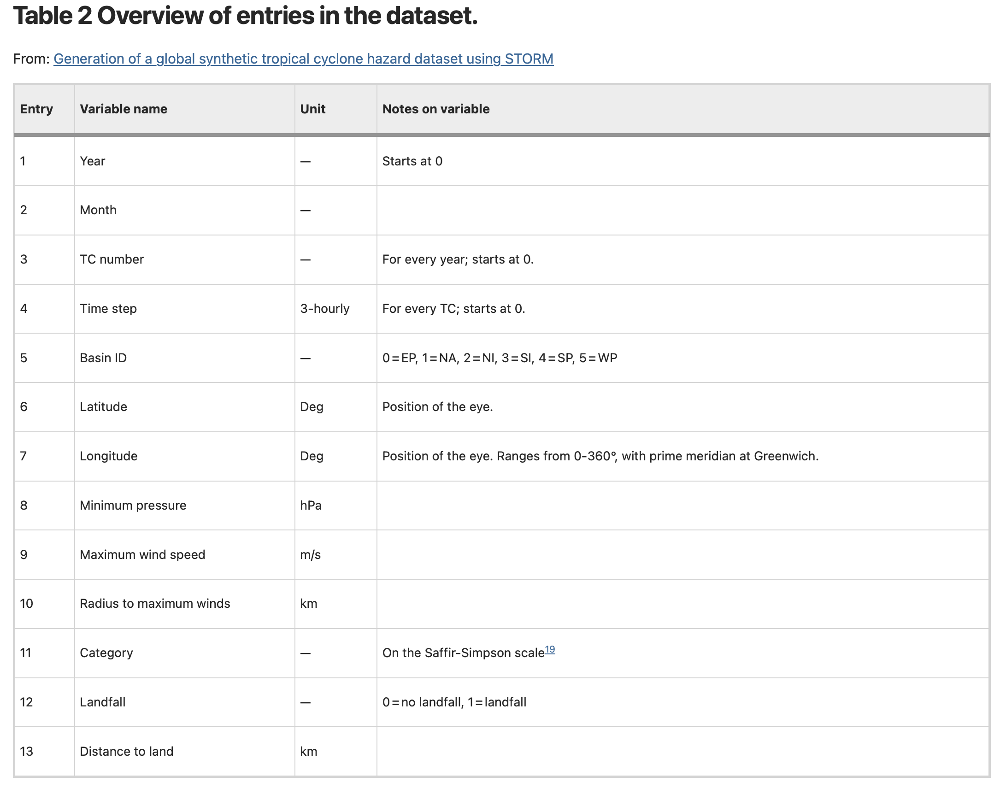

# CHEER-STORM
repo for codes/processing of STORM datasets for CHEER
Version 1.1, 05 Jan 2023

GitHub Repo: git@github.com:BrianOBlanton/CHEER-STORM.git

## Running the notebook

### Binder Notebook

The easiest way to run the notebook is to use Binder.  Binder builds a python environment and deploys the notebook to a webpage. 

<pre>
 http://tinyurl.com/4crcpcr3
</pre>

(or  https://mybinder.org/v2/gh/BrianOBlanton/CHEER-STORM/HEAD?labpath=STORM_LoadDemo-NoCartopy.ipynb)

### Run locally
Alternatively, if a jupyter server already exists, it should be easy to build a custom python environment and use that to launch / run the nb. 

To make a python environment with the requirements.txt file:  

<pre>
conda create --name cheer --file  requirements.txt
</pre>

Activate the new env, install jupyter components, and add cheer kernel to jupyter.

<pre>
conda activate cheer
pip install ipython jupyterlab ipykernel
python -m ipykernel install --user --display-name cheer --name cheer
</pre>

Then, fire up the jupyter server.  


## Reference articles / data
https://www.nature.com/articles/s41597-020-0381-2

https://doi.org/10.4121/uuid:82c1dc0d-5485-43d8-901a-ce7f26cda35d

https://data.4tu.nl/articles/STORM_IBTrACS_present_climate_synthetic_tropical_cyclone_tracks/12706085?file=24876980

The 10,000 year TC STORM dataset, based on the present climate, is publicly accessible and can be found on the 4TU.Centre for Research Data repository (https://doi.org/10.4121/uuid:82c1dc0d-5485-43d8-901a-ce7f26cda35d). The dataset is split in separate files per basin, with each .txt-file containing 1,000 years of simulations (i.e. 10 files per basin). Each .txt file consists of a series of arrays, with each array being a single time step (3-hourly) for a synthetic TC. The colmns of the arrays are given in this table:



## Draft track files in CoPe Google Drive: 

https://drive.google.com/drive/folders/1dPeUHDHJePOlrVup2u2e3Pp9c7a8x88U?usp=share_link

Trackfile naming: 
```
<Region>_<Climate>_<EnsembleSetNumber>_<AbsoluteStormNumber>.csv
```

## Track file header: 
```
cols=[
    'Year',       # Starts at 0
    'Month', 
    'TC_number',  # For every year; starts at 0.
    'Time_step',  # 3-hr, For every TC; starts at 0.
    'Basin_ID',   # 0=EP, 1=NA, 2=NI, 3=SI, 4=SP, 5=WP
    'Latitude',   # Deg, Position of the eye.
    'Longitude',  # Deg, Position of the eye. Ranges from 0-360°, with prime meridian at Greenwich.
    'Min_pres',   # hPa
    'MaxWindSpd', # m/s
    'RMW',        # km
    'Category',   #
    'Landfall',   # 0= no landfall, 1= landfall
    'Dist2land',  # km
    'dist2nc',    # distance to NC screening circle center [deg]
    'dist2tx'     # distance to TX screening circle center [deg]
    ]
```

